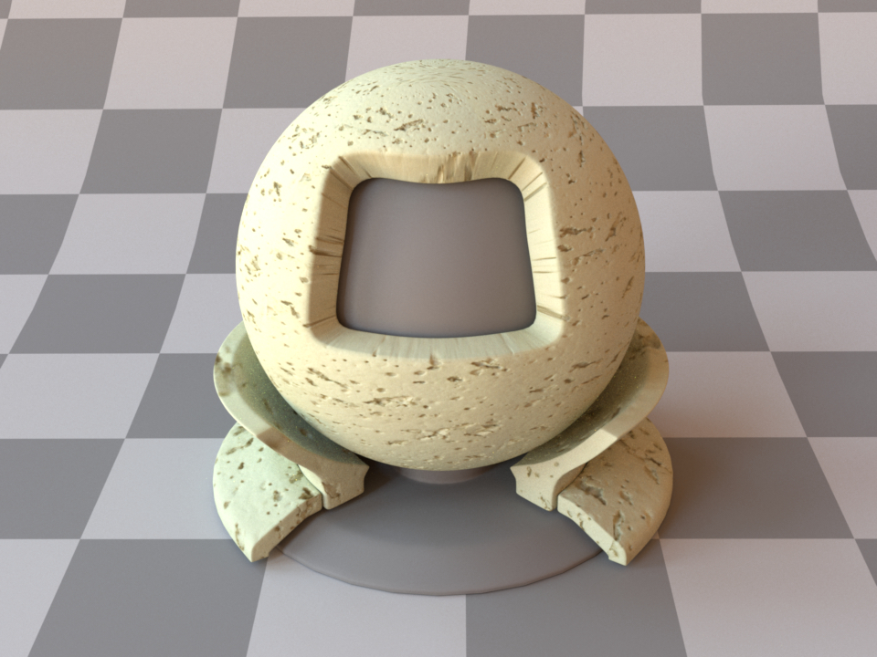
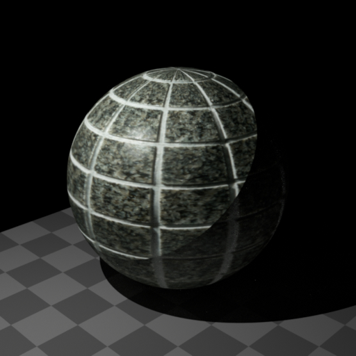
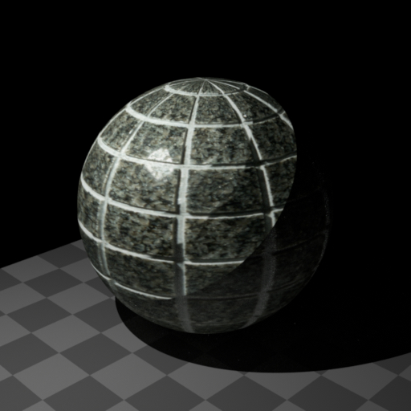
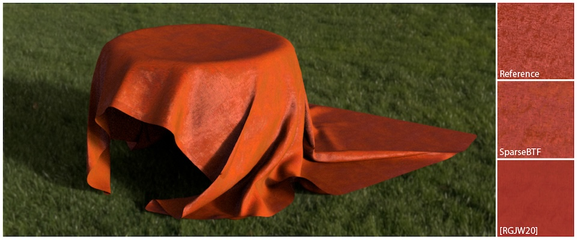
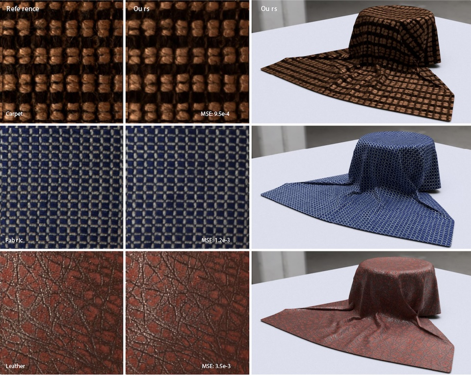

# BTF Rendering

Custom Mitsuba3 plugin to render measured BTF (Bidirectional Texture Function).


## BTF Data Preparation and Rendering

Download [UBO2003 or ATRIUM BTF Dataset](https://cg.cs.uni-bonn.de/btfdb) and place the downloaded zip files like below. You can also locate them anywhere and point the `filename` parameter to the correct path.

```bash
.
├── UBO2003
│   ├── UBO_IMPALLA256.zip
│   ├── ...
├── ATRIUM
│   ├── CEILING.zip
│   ├── ...
├── custom_bsdf
├── download_large_data.py
├── rendering.py
├── scenes
├── ...
```

After placing the BTF dataset, you can render the scenes in the `scenes/` directory using the provided `rendering.py` script.

## Measured BTF (_measuredbtf_)

| Parameter | Type      | Description                                                                                               |
| :-------- | :-------- | :-------------------------------------------------------------------------------------------------------- |
| filename  | string    | Path to the BTF database file (UBO2003 / ATRIUM format zip).                                              |
| scale     | float     | Scale factor applied to overall reflectance. (Default: 1.0)                                               |
| p         | float     | Power parameter for inverse distance weighting (smoothness). Smaller = smoother. (Default: 4.0)           |
| k         | int       | Number of nearest neighbors used for interpolation. k = 1 is equivalent to nearest neighbor. (Default: 4) |
| gamma     | float     | Gamma correction applied to loaded texels. (Default: 2.2)                                                 |
| to_uv     | transform | Optional UV transform. (Default: none)                                                                    |

The measured BTF plugin supports two types of BTF datasets: UBO2003 and ATRIUM. Both datasets are available from [the University of Bonn](https://cg.cs.uni-bonn.de/btfdb). The following images show the appearance of two example materials from each dataset.

|               UBO2003 IMPALLA                |                ATRIUM CEILING                |
| :------------------------------------------: | :------------------------------------------: |
|  |  |

XML:

```xml
<bsdf type="measuredbtf">
    <string name="filename" value="UBO2003/UBO_IMPALLA256.zip"/>
    <transform name="to_uv">
        <scale value="5.0"/>
    </transform>
</bsdf>
```

Python:

```python
"type": "measuredbtf",
"filename": "UBO2003/UBO_IMPALLA256.zip",
"to_uv": mi.ScalarTransform4f.scale(5.0),
```

`filename` is the name of the BTF database file in zip format.

The custom python BSDF plugin can be registered in Mitsuba3 as follows:

```python
import mitsuba as mi

mi.set_variant("llvm_ad_rgb")

from custom_bsdf.measuredbtf import MeasuredBTF

mi.register_bsdf("measuredbtf", lambda props: MeasuredBTF(props))
```

### Interpolation and Power Parameter

This custom plugin interpolates BTF. The interpolation is done by [k-nearest neighbor sampling](https://en.wikipedia.org/wiki/K-nearest_neighbors_algorithm) and [inverse distance weighting](https://en.wikipedia.org/wiki/Inverse_distance_weighting).
The weight in inverse distance weighting is controlled by the power parameter _p_. Lower values blur / smooth angular variation (so specular highlights weaken). Higher values (e.g. 32) approach nearest-neighbor behavior, exposing angular sparsity and causing sharper but sometimes discontinuous transitions.

The following figures show the difference in appearance when _p_ is changed. When _p_ is small (_p_=1), the texture is smooth and specular reflection is weak. On the other hand, when _p_ is large (_p_=32), the texture has discontinuous boundaries. This is because the angle of the captured BTF data is sparse.
| _p_ = 1 | _p_ = 2 | _p_ = 4 | _p_ = 32 |
| :-: | :-: | :-: | :-: |
|  |  |  |  |

## Mitsuba2 Version

This repository was originally developed for Mitsuba2, and now it has been refactored for Mitsuba3. Some of the features have changed. If you want to check the previous version, please refer to the [previous commit](https://github.com/elerac/btf-rendering/tree/c7209b865b1bfe54ee0b6df6d3c3f06e46a7bcad).

## Rendered Images from Other Papers

I collected the rendered images from other papers that use the 3D model of cloth originated at this repository ([`scenes/cloth/cloth.obj`](scenes/cloth/)). These beautifully rendered images enhance the effectiveness of their excellent methods for BTF data processing.


_Kavoosighafi et al., "SparseBTF: Sparse Representation Learning for Bidirectional Texture Functions", Eurographics Symposium on Rendering, 2023. [[Link]](https://diglib.eg.org/handle/10.2312/sr20231123)_


_Dou et al., "Real-Time Neural BRDF with Spherically Distributed Primitives", CVPR, 2024. [[Link]](https://openaccess.thecvf.com/content/CVPR2024/papers/Dou_Real-Time_Neural_BRDF_with_Spherically_Distributed_Primitives_CVPR_2024_paper.pdf)_

Feel free to use the cloth 3D model, scene file, and code here for academic purposes.
